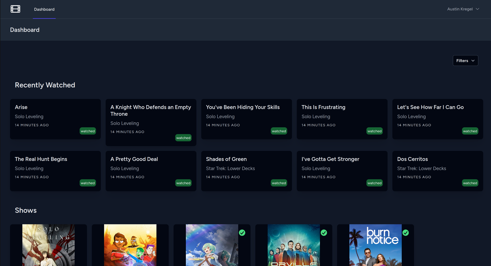
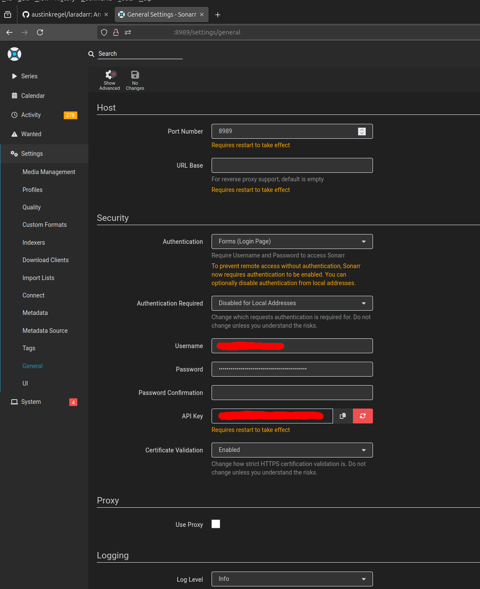

# Laradarr
Laradarr is an app that allows you to import your Radarr, and Sonnar libraries; along with your Trakt watch history.



## Installation
This project uses Laravel sail for development. To get started, you will need to have Docker installed on your machine. Once you have Docker installed, you can run the following commands to get started:

```bash
git clone git@github.com:austinkregel/laradarr
composer install
sail up -d
sail art migrate
```

Once set up, you'll need to configure your Radarr, Sonarr, and Trakt API keys in the `.env` file. 

The API keys for Radarr and Sonarr can be found on the general settings page for each app


## Contributing
If you would like to contribute to this project, please feel free to fork the project and submit a pull request. I will review the pull request as soon as possible.

## License
This project is open-sourced software licensed under the [MIT license](https://opensource.org/licenses/MIT).

